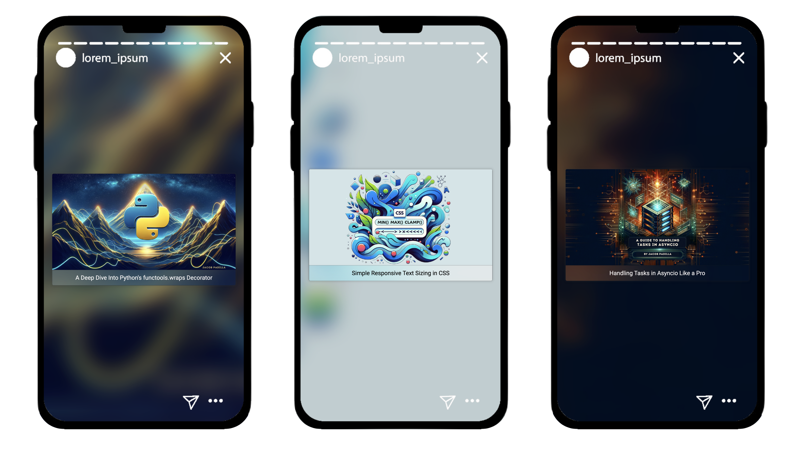

<h1 align="center">Share Articles on Instagram Stories</h1>

<p align="center">
    
</p>

<p align="center">A tool to create beautiful Instagram stories to share articles/websites with!</p>

## Setup
Download the repo:
```
$ git clone https://github.com/jpjacobpadilla/Share-Articles-On-Instagram-Stories.git
```

Go into the repository:
```
$ cd Share-Articles-On-Instagram-Stories
```

Create a virtual environment to store the project dependencies
```
$ python -m venv venv
```

Activate the environment
```
$ source venv/bin/activate
```

Install the dependencies
```
$ pip install -r requirements.txt
```

Generate an image!

This project accepts a website url and then parses the page to get the og:image.
It will save the image in the `images` directory.
```
$ python generate.py [url here without the brackets]
```

Example:
```
$ python generate.py https://jacobpadilla.com/articles/Python-Flask-Login-System
```

## Contributing
Contributions are welcome! If you have a suggestion or an issue, please use the issue tracker to let me know.
